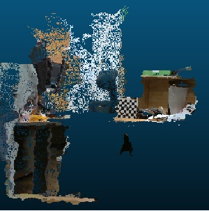

#Calibration
RGB-IR 카메라 통합 3D point cloud 구현

## 주요 과제
* Intel D435 카메라의 오픈 소스 librealsense2를 활용하여 데이터 획득 및 처리
* 체스보드 기반의 캘리브레이션을 통해 RGB, IR 카메라 내부 파라미터 추출
* RGB 카메라와 IR 카메라의 외부 파라미터인 회전, 이동 측정
* IR 카메라 중심의 depth 값을 카메라 내부, 외부 파라미터를 통해 RGB 영상 좌표계로 변환
* 체스보드 코너점을 활용한 재투영오차 계산

## 결과

 

 
